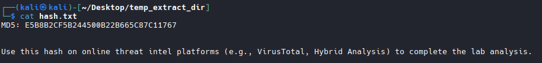
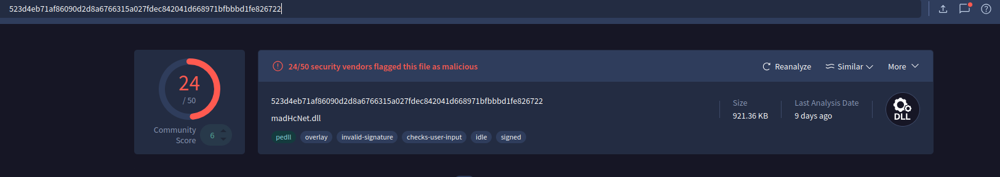
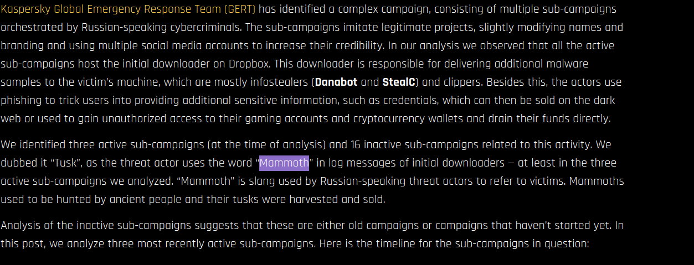
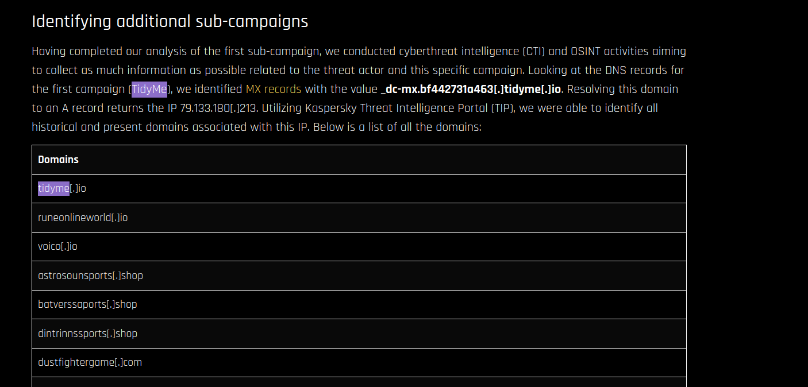
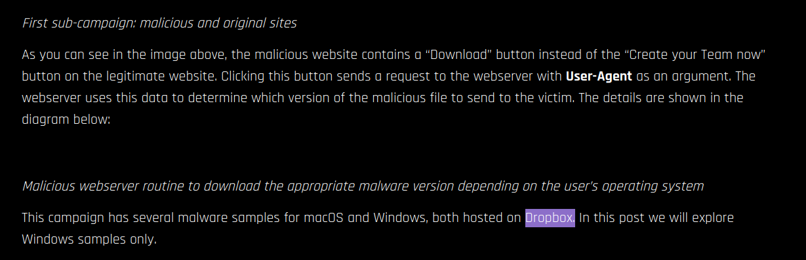
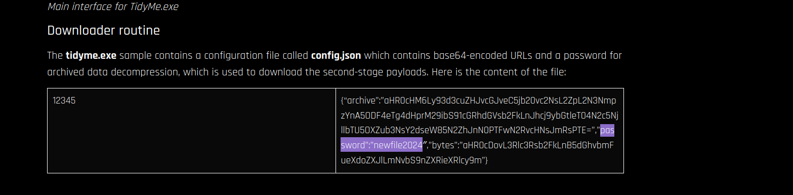
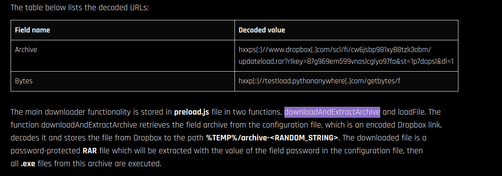
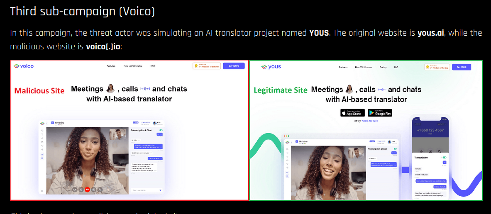
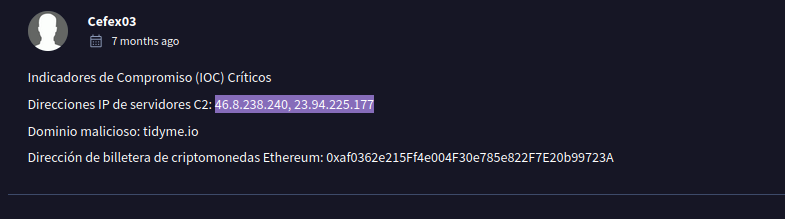
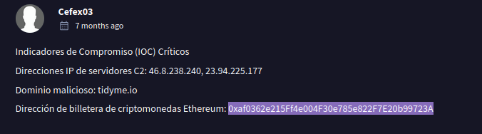

  
# Cyberdefenders - Tusk Infostealer Lab

 
## GUÍA COMPLETA EN ESPAÑOL 

  
  
  

  

# Indice  
## Question 1  
## Question 2  
## Question 3  
## Question 4  
## Question 5  
## Question 6  
## Question 7  
## Question 8  
## Question 9  

## Question 1: In KB, what is the size of the malicious file? / En KB, ¿Cuál es el tamaño del archivo malicioso?

Al descargarnos el archivo proporcionado por el lab, nos da un hash:  

Para encontrar el tamaño del archivo, he buscado el hash en virustotal, y aqui nos indica el dato:  

## Question 2: What word do the threat actors use in log messages to describe their victims, based on the name of an ancient hunted creature? / ¿Qué término usan los atacantes en los logs para llamar a sus víctimas, basado en el nombre de una vieja criatura de caza?  

Estube un rato buscando en virustotal pero no aparecía nada, asi que decidí buscar en google Tusk Infostealer y encontramos la siguiente [página](https://www.infostealers.com/article/tusk-unraveling-a-complex-infostealer-campaign/): 

## Question 3: The threat actor set up a malicious website to mimic a platform designed for creating and managing decentralized autonomous organizations (DAOs) on the MultiversX blockchain (peerme.io). What is the name of the malicious website the attacker created to simulate this platform? / El actor de amenazas creó un sitio web malicioso para imitar una plataforma diseñada para crear y gestionar organizaciones autónomas descentralizadas (DAO) en la blockchain MultiversX (peerme.io). ¿Cuál es el nombre del sitio web malicioso que el atacante creó para simular esta plataforma?  

Seguimos buscando en la página anterior y encontramos esta sección:  

## Question 4: Which cloud storage service did the campaign operators use to host malware samples for both macOS and Windows OS versions? / ¿Qué servicio de almacenamiento en la nube usarom los operadores de camapaña como host del malware para macOS y Windows OS versions?  

Seguimos buscando en la página y encontramos la respuesta:  

## Question 5:  The malicious executable contains a configuration file that includes base64-encoded URLs and a password used for archived data decompression, enabling the download of second-stage payloads. What is the password for decompression found in this configuration file? / El ejecutable malicioso contiene un archivo de configuración que incluye URLs codificadas en base64 y una contraseña utilizada para la descompresión de datos archivados, lo que permite la descarga de cargas útiles de segunda etapa. ¿Cuál es la contraseña para la descompresión que se encuentra en este archivo de configuración?

Seguimos buscando en la página: 

## Question 6: What is the name of the function responsible for retrieving the field archive from the configuration file? / ¿Cuál es el nombre de la función responsable de obtener el campo archive del archivo de configuración?

Seguimos investigando en la página:  

## Question 7: In the third sub-campaign carried out by the operators, the attacker mimicked an AI translator project. What is the name of the legitimate translator, and what is the name of the malicious translator created by the attackers? / En la tercera subcampaña llevada a cabo por los operadores, el atacante imitó un proyecto de traductor de IA. ¿Cuál es el nombre del traductor legítimo y cuál es el nombre del traductor malicioso creado por los atacantes?  

Seguimos investigando en la página:  

  

## Question 8: The downloader is tasked with delivering additional malware samples to the victim’s machine, primarily infostealers like StealC and Danabot. What are the IP addresses of the StealC C2 servers used in the campaign? / El descargador tiene la tarea de entregar muestras adicionales de malware a la máquina de la víctima, principalmente infostealers como StealC y Danabot. ¿Cuáles son las direcciones IP de los servidores C2 de StealC utilizados en la campaña?  

Ahora buscaremos en virustotal, y encontramos en los comentarios de nuestra búsqueda anterior:  

  

## Question 9: What is the address of the Ethereum cryptocurrency wallet used in this campaign? / ¿Cuál es la dirección de la cartera de criptoactivos Ethereum usada en esta campaña?  

En el mismo comentario de antes, tenemos la respuesta:  

  

